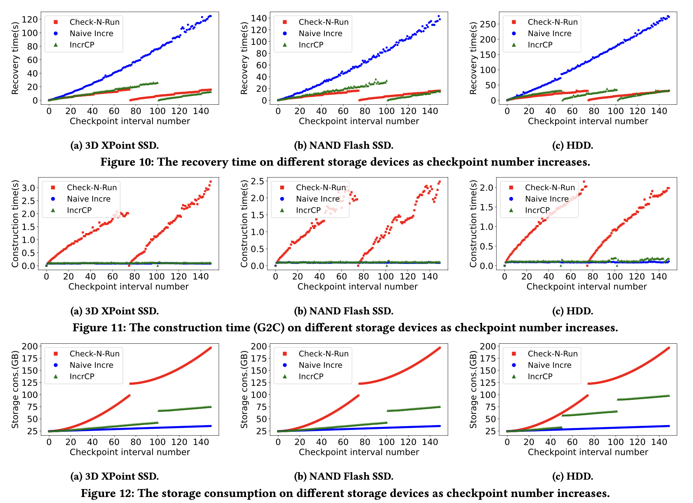

# IncrCP: Decomposing and Orchestrating Incremental Checkpoints for Effective Recommendation Model Training

This package includes the source codes and testing scripts in the paper *IncrCP: Decomposing and Orchestrating Incremental Checkpoints for Effective Recommendation Model Training*.

```
.
├── src          
│   ├── ...
│   ├── two_d_chunk/            # Source code of 2DChunk
│   ├── incrcp.py               # Checkpointing interfaces of IncrCP
│   ├── naive_ckpt.py           # Checkpointing interfaces of Naive Incre and Check-N-Run
├── models
│   ├── deepfm                  
│   │   └── test_ckpt.sh        # Checkpoint construction test
│   │   └── ...
│   ├── dlrm                    
│   │   └── test_ckpt.sh        # Checkpoint construction test
│   │   └── ...
│   └── pnn                     
│   │   └── test_ckpt.sh        # Checkpoint construction test
│   │   └── ...
├── README.md
├── requirements.txt            # Python package requirements
└── scripts                     
    ├── load_ckpt.py
    ├── test_deepfm
    │   └── test_load.sh        # Recovery test
    ├── test_dlrm
    │   └── test_load.sh        # Recovery test
    └── test_pnn
        └── test_load.sh        # Recovery test

```

## Part 1: Preparations

1. clone this repo with:
```
git clone --recurse-submodules https://github.com/linqy71/IncrCP_paper.git
cd IncrCP_paper
export INCRCP_PATH=$(pwd)
```

2. install package requirements
```
conda create --name incrcp python=3.8
pip install -r requirements.txt

export CUDA_VISIBLE_DEVICES=0,1,2,3
```

3. install 2DChunk

```
cd $INCRCP_PATH/src
python setup.py install
```

4. export the directory of interfaces to PYTHONPATH

```
export PYTHONPATH=$PYTHONPATH:$INCRCP_PATH/src
```

5. Download [Criteo Kaggle Display Advertising Challenge Dataset](https://ailab.criteo.com/ressources/).


## Part 2: Result Reproduction

### Overall Performance reproduction

Here is our overall performance results when training DLRM. 


To reproduce this, first test `checkpoint construction` and then test `recovery`.
Before Runing the scripts, make sure paths in the scripts is replaced to your own local paths.

** 1. test checkpoint construction **

```
cd $INCRCP_PATH/models/dlrm
bash test_ckpt.sh
```

** 2. test recovery **

```
cd $INCRCP_PATH/scripts
bash test_dlrm/test_load.sh
```

### Reproduction for other results

To reproduce the results for DeepFM and PNN, the steps are similar:
```
cd $INCRCP_PATH/models/deepfm
bash test_ckpt.sh 1 1 1

cd $INCRCP_PATH/scripts
bash test_deepfm/test_load.sh 1 1 1
```
Parameters of the scripts indicates for enabling or disabling a specific method.
See the scripts for details.
```
cd $INCRCP_PATH/models/pnn
bash test_ckpt.sh 1 1 1

cd $INCRCP_PATH/scripts
bash test_pnn/test_load.sh 1 1 1
```